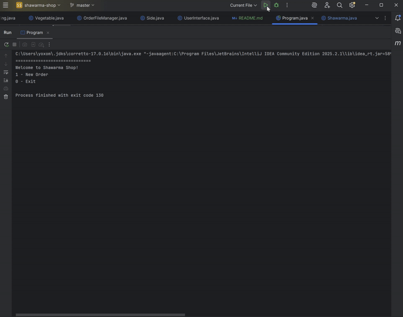
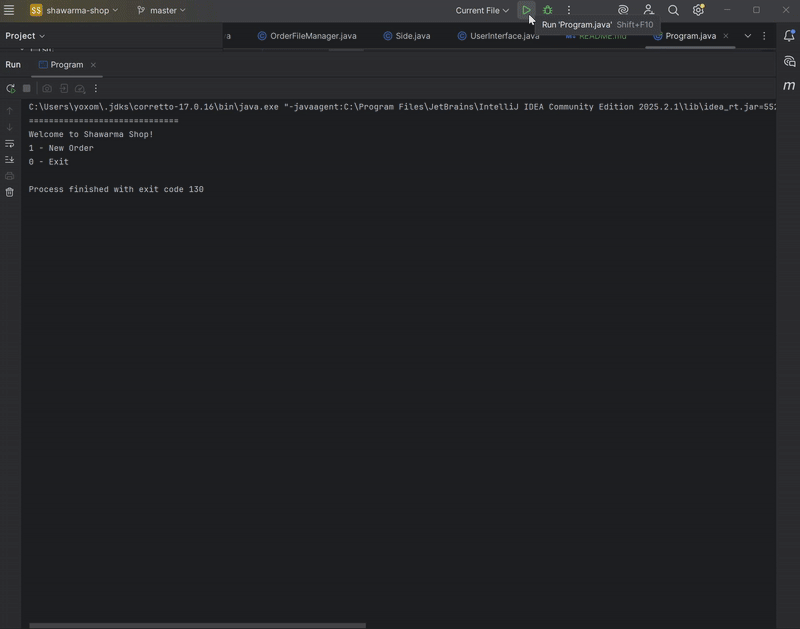
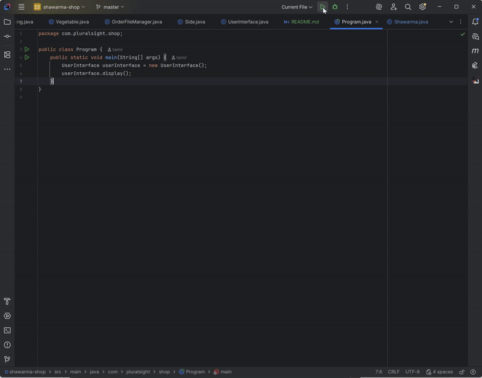

# Shawarma Point-of-Sale System

## Description of the Project

This Java console application simulates the point-of-sales system a custom shawarma shop. The program allows customers to build fully customized shawarmas, add drinks and fries, manage their orders, review the total cost, and generate receipt files.

It is designed for employees and trainees who need an efficient way to take orders without relying on handwritten notes. The application automates ordering, ensures accuracy, and organizes order data for easier workflow management.

## User Stories

As a customer, I want to customize my shawarma, so that I can order exactly what I like.

As a customer, I want to select bread, size, toppings, sauces, and extras, so that my sandwich is prepared correctly.

As a user, I want to add drinks and fries, so that my order is complete.

As a cashier, I want the system to display order details, so that I can verify everything with the customer before checkout.

As a cashier, I want the application to calculate prices automatically, so that I don’t make mistakes.

As a user, I want each order saved as a receipt file, so that I can access order history later.

As a user, I want to cancel or restart an order, so that I am not locked into mistakes.

## Setup

Instructions on how to set up and run the project using IntelliJ IDEA.

### Prerequisites

- IntelliJ IDEA: Ensure you have IntelliJ IDEA installed, which you can download from [here](https://www.jetbrains.com/idea/download/).
- Java SDK: Make sure Java SDK is installed and configured in IntelliJ.

### Running the Application in IntelliJ

Follow these steps to get your application running within IntelliJ IDEA:

1. Open IntelliJ IDEA.
2. Select "Open" and navigate to the directory where you cloned or downloaded the project.
3. After the project opens, wait for IntelliJ to index the files and set up the project.
4. Find the main class with the `public static void main(String[] args)` method. "Program" class in our case.
5. Right-click on the file and select 'Run 'YourMainClassName.main()'' to start the application.

## Technologies Used

- Java 17.
- Standard Java libraries for file handling, collections, and console interaction.

## Demo

- Add a sandwich 

- Add a drink 

- Add dries and checkout 

## Future Work

- Add persistence for menu items using files or a simple database.

- Convert the console interface into a GUI or web-based application.

- Add automated tests for price calculations and input validation.

- Reduce repeated code by breaking down UserInteface class into smaller classes.

## Resources

- Potato Sensei
- https://www.w3schools.com/
- Pluralsight workbooks

## Team Members

- Tamir Dmitriev – Development, project structure, design
## Thanks

- To Potato Sensei for continuous support and guidance.
- To Jason, Roger, and Stephen for their feedback.
